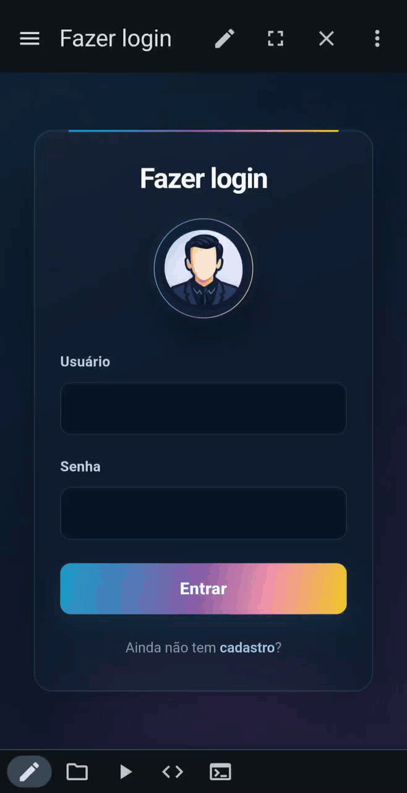

# My Gallery


A responsive web application for managing a poetry gallery, built with HTML, CSS, and JavaScript. Users can create accounts, authenticate, and organize poems, while browser `localStorage` provides local data persistence.

## Live Demo

🔗 **[Open the live gallery](https://lianeheidemann.github.io/poetry-gallery/)**

## Overview

<p align="center">
  
</p>

## How to Run

The fastest way to try the project is the [live demo](https://lianeheidemann.github.io/poetry-gallery/) above. To run it locally instead:

1. Open the project in **Visual Studio Code**.
2. Install the [Live Server](https://marketplace.visualstudio.com/items?itemName=ritwickdey.LiveServer) extension.
3. Right-click `cadastrar.html`.
4. Select **Open with Live Server**.
5. Create a username and password.
6. Open `login.html` and sign in with the registered credentials.

> Data is stored only in the browser's `localStorage`. This project is intended for learning and local demonstrations, not production authentication.

## Test User

```text
Username: user
Password: password
```

## Responsive Mobile Experience

<p align="center">
  
</p>

<!-- redeploy after interface rollback -->
